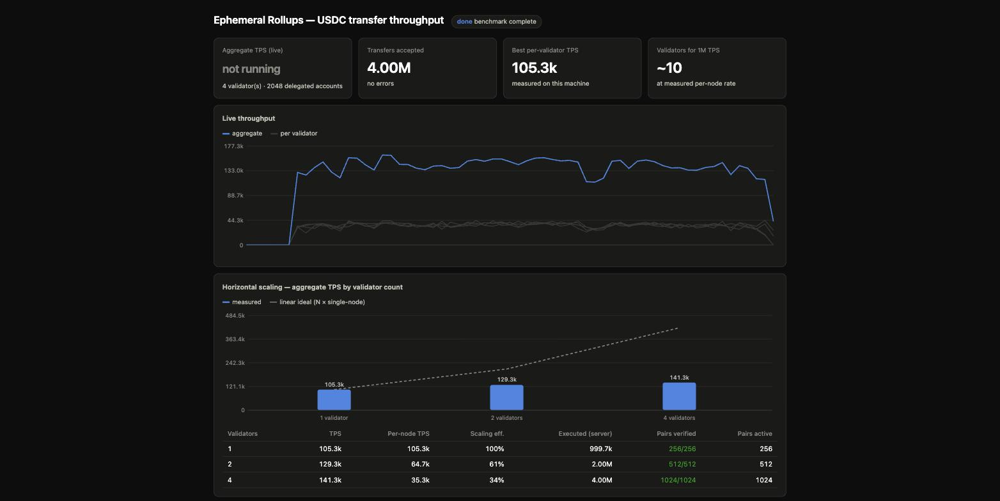

# er-usdc-scaling-poc

**Can ephemeral rollups reach 1M TPS for USDC transfers?** This PoC answers
empirically: a **single 128-core bare-metal machine runs ~565k USDC-transfer
TPS end-to-end** across co-located ephemeral validators — with sub-millisecond
latency below saturation and every transfer balance-verified. Ephemeral
validators share no state and no consensus, so capacity is additive:
**1M TPS ≈ two such machines** (roughly 13 validators at the measured
86%-efficiency operating point), sharded by payment cohort.

## Quickstart

```sh
git clone https://github.com/magicblock-labs/er-usdc-scaling-poc.git
cd er-usdc-scaling-poc
./setup.sh        # fetches magicblock-validator (dev branch) + builds everything
./run.sh          # runs the 1→2→4 validator sweep, opens the live dashboard
```

Prerequisites: Rust (rustup), and the Agave tools (`solana-test-validator`)
on PATH — `setup.sh` checks both and prints install instructions if missing.
Already have a `magicblock-validator` checkout? `./setup.sh --link <path>`.

`setup.sh` clones the validator's `dev` branch pinned to the commit this PoC
was validated against (`VALIDATOR_COMMIT` at the top of the script — bump it
deliberately, since the bench shares Cargo pins and the config schema with
the validator tree).

The dashboard (http://127.0.0.1:3777) opens automatically and shows live
aggregate and per-validator TPS, end-to-end latency, the scaling chart
against the linear ideal, verification status, and the 1M-TPS extrapolation.
`Ctrl+C` stops everything.

## What it actually does

Nothing is simulated — the benchmark drives the production delegation flow:

1. Starts a local Solana base chain (`solana-test-validator`) with the
   delegation program (DLP) and the ephemeral-token (eATA) program.
2. Creates a USDC-like mint (6 decimals) and, per user: an ATA, an eATA
   deposit, a **real delegation of the eATA to the validator**, and a
   delegated fee escrow.
3. Starts N ephemeral validators (`lifecycle = "ephemeral"`), each assigned a
   disjoint shard of users; the ERs clone the delegated accounts on demand.
4. Blasts **signed SPL-token transfers** between projected USDC ATAs through
   JSON-RPC `sendTransaction` (base64, `skipPreflight`, ~400-tx batches).
5. Counts TPS **server-side** (transactions that entered processing minus
   sequencer/execution failures, from the validators' Prometheus endpoints)
   and verifies **balance conservation and activity for every pair** afterwards.
6. Measures **end-to-end latency** while the load runs: each validator has a
   reserved probe pair on which a transfer is sent every ~200ms *without*
   `skipPreflight`, so the RPC responds only after execution — the HTTP
   roundtrip is send → executed (queue wait + execution) under load.

## Measured results

### Bare-metal Linux node (128 cores)

```sh
./run.sh --sweep 1,2,4,6,8,10,12,16 --users-per-shard 512 --presign-txs 1000000 \
         --blocktime-ms 400 --connections 10 --batch-size 400 --signer-threads 3
```

16M transfers total, every pair balance-verified at every point:

| Validators | Aggregate TPS | Per-node TPS | Scaling eff. | Latency avg / p99 | Verified pairs |
|-----------:|--------------:|-------------:|-------------:|------------------:|---------------:|
| 1          | 88.3k         | 88.3k        | 100%         | 27.7 / 160 ms     | 256/256 |
| 2          | 169.2k        | 84.6k        | 96%          | 29.4 / 165 ms     | 512/512 |
| 4          | 325.9k        | 81.5k        | 92%          | 32.0 / 188 ms     | 1024/1024 |
| 6          | 456.0k        | 76.0k        | 86%          | 33.9 / 224 ms     | 1536/1536 |
| 8          | 524.7k        | 65.6k        | 74%          | 30.6 / 217 ms     | 2048/2048 |
| 10         | 563.7k        | 56.4k        | 64%          | 41.9 / 306 ms     | 2560/2560 |
| 12         | **564.5k**    | 47.0k        | 53%          | 43.8 / 324 ms     | 3072/3072 |
| 16         | 557.7k        | 34.9k        | 39%          | 44.3 / 335 ms     | 4096/4096 |

Takeaways:

- **Scaling is near-linear while cores last**: 96% efficiency at 2
  validators, 92% at 4, 86% at 6. The plateau at ~560k from N=10 is the
  single-machine ceiling, not an architectural one — all N validators *plus*
  the load generator share the same 128 cores, and each validator sizes its
  executor pool for a whole machine (`(cores−2)/2` threads), so co-located
  validators increasingly oversubscribe the box.
- **Per-node throughput is bound by single-core speed** (every transaction
  passes through a single-threaded sequencer): the laptop's faster cores
  reach 97–106k/node vs the server's 88k, while the server wins on aggregate.
  Node speed scales with core speed; fleet capacity scales with core count.
- **1M TPS ≈ two machines like this one** — or the same validators spread
  across smaller right-sized hosts, since validators share nothing and each
  extra host removes the co-location penalty.
- Latency stayed at 28–44 ms average even at full saturation (see below for
  why that is queueing, and what latency looks like below the ceiling).

### Laptop run (Apple M5 Max, 18 cores, macOS)

Same benchmark, stock `cargo build --release`, 1M pre-signed transfers per
validator:

| Validators | Aggregate TPS | Per-node TPS | Latency avg / p99 | Verified pairs |
|-----------:|--------------:|-------------:|------------------:|---------------:|
| 1          | **97.2k**     | 97.2k        | 39.5 / 131 ms     | 256/256 |
| 2          | 132.8k        | 66.4k        | 42.9 / 123 ms     | 512/512 |
| 4          | 135.4k        | 33.8k        | 54.2 / 179 ms     | 1024/1024 |



Single-node throughput on the M5 sits at ~100k TPS (97–106k across runs) —
per-node above the server thanks to faster cores — but the 18-core laptop
saturates around ~135k aggregate where the 128-core server keeps scaling.

### End-to-end latency

Latency is measured by probe transfers sent without `skipPreflight` while the
load runs, so each sample is a full send → executed roundtrip:

- **Light load: ~0.5 ms avg / 0.7 ms p99.** The execution path itself is
  sub-millisecond.
- **At saturation: ~30–70 ms avg.** That is queue wait, not execution — at
  ~100k TPS an average latency of ~35 ms corresponds (Little's law) to ~3.5k
  transactions in flight ahead of the probe in the ingestion + sequencer
  pipeline. Push a validator to its throughput ceiling and latency is the
  queue you chose to build; run it below the ceiling and transfers execute in
  under a millisecond.

### Platform notes

The bare-metal Linux node outperformed the laptop on aggregate exactly as
expected: a quiet dedicated box (macOS background services measurably swung
laptop results by ~20%), Linux-only code paths (the engine's ledger applies
`fadvise` access hints only on Linux), and 7× the cores. For further tuning
on the target machine: build with `RUSTFLAGS="-C target-cpu=native"` and
`lto`/`codegen-units = 1` in the release profile. On Apple silicon
`target-cpu=native` showed no measurable gain (the default target already
covers the M-series feature set); x86 servers have more to gain since
baseline x86-64 codegen predates AVX2.

### Bottleneck decomposition (single validator, M5)

| Configuration | N=1 TPS |
|---|---:|
| JIT client signing, 50ms blocks | 92.7k |
| Pre-signed load, 400ms blocks | 102–106k |
| Pre-signed + server sigverify skipped (diagnostic build) | 113.5k |

Ed25519 verification is only ~10% of the per-node cost; the ceiling is the
non-crypto pipeline (RPC ingestion, per-tx account ensure, the single-threaded
sequencer). Sigverify is the *scalable* part — stateless and batchable — while
the sequencer is the architectural per-node limit, which is exactly why
throughput scales horizontally by sharding accounts across validators.

## Parameters

`./run.sh --help` prints the same list; unknown flags pass through to the
`er-bench` binary.

| Flag | Default | Meaning |
|---|---|---|
| `--sweep <list>` | `1,2,4` | Validator counts to run, comma-separated |
| `--users-per-shard <n>` | `512` | Delegated USDC holders per validator (even; pairs = n/2). Keep ≥ 256: with too few pairs, write conflicts dominate the scheduler and the sequencer sheds most of the load as drops |
| `--presign-txs <n>` | `1000000` | Transfers pre-signed per shard before the timed window; `0` = sign just-in-time |
| `--blocktime-ms <n>` | `400` | ER block time; keep 400 with presign so the blockhash outlives sign + send |
| `--duration-secs <n>` | `30` | Load duration (JIT mode only) |
| `--connections <n>` | `10` | Parallel HTTP connections per validator |
| `--batch-size <n>` | `400` | Transactions per JSON-RPC batch (1 MiB body cap) |
| `--signer-threads <n>` | `3` | Signer threads per validator shard |
| `--dashboard-port <n>` | `3777` | Monitoring UI port |
| `--no-hold` | — | Exit after the sweep instead of keeping the dashboard up |

Results are also written to `results.json`. The dashboard page
(`bench/dashboard.html`) is served from disk, so UI tweaks show up on refresh.

## Repo layout

```
setup.sh, run.sh          entry points
bench/                    the benchmark binary (Rust) + dashboard.html
magicblock-validator/     validator checkout (dev branch), created by setup.sh
docs/                     dashboard screenshot
.run/, results.json       run artifacts (gitignored)
```

## Scope and honest limitations

- **Intra-shard traffic.** Transfers here happen between users on the same
  rollup. Transfers across shards remain possible through Solana: state
  settles to the base layer, where funds move between rollups via
  commit + redelegation — that path is not part of the measured TPS.
- **One machine per sweep.** Validators and the load generator contend for
  cores, so multi-validator per-node numbers are lower bounds; true linear
  scaling distributes validators (and load generators) across hosts.
- **Shared validator identity.** All ERs run the DLP test authority keypair,
  so one delegation target serves every shard; each shard is still served
  exclusively by its own validator, and distinct identities use the same
  data path.
- The mint is USDC-like (6 decimals), not the canonical USDC mint address.
